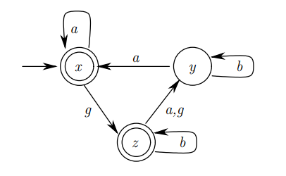

# Tutorial Supremica
Minitutorial sobre como usar o Supremica.

## O que é o Supremica?

## Instalação

> Windows
>  

> Linux
> 

## Conceitos introdutórios

1. Eventos:\
   Parte essencial, representam ações que provocam uma mudança no sistema. Esses eventos, também chamados de __transições__, são capazes de ligar estados e possuem um momento específico de ocorrência que desencadeia a transição de um estado para outro. 
2. Estados:\
   Em sistemas a eventos discretos os estados representam a condições, ou ainda status, do sistema em determinado momento, momento esse definido após determinada transição. A transição de um estado para outro é desencadeada por eventos específicos. São eles que determinam a saída e ditam o ponto inicial do sistema.

   O estados também podem ser classificados em 4 tipos:
   - Inicial
   - Marcado
   - Não marcado
   - Proibido
3. Linguagens:\
   Quando há uma sequência de estados, relacionados com eventos, o comportamento de um sistema a eventos discretos pode ser descrito por essa sequência, tal desempenho é modelado por uma linguagem.

   Todo SED está associado à um conjunto de eventos $E$, esse conjunto é pensado como o alfabeto e sequências desses eventos são pensadas como palavras dessa linguagem, ou ainda strings. 

4. Autômatos Finitos:\
   Método capaz de representar linguagens e lógicas, na forma de grafos, através de eventos e estados.

   

   Os nós são os estados, enquanto que as setas representam os eventos. Em essência, um autômato é uma abstração matemática que descreve um sistema que passa de um estado para outro em resposta a um conjunto de regras.
   
5. Autômato Finito Extendido:\
   Um outro tipo de autômato que utiliza do conceito de __guardas__ e __ações__ para ler e atualizar variáveis enquanto executa transições. Guardas são utilizados para permitir um evento sobre certas condições, já uma ação é o ato de mudar o estado de determinada variável.
    
   O estado de algo pode ser uma variável e seus valores são mudadas pelas ações e monitoradas pelos guardas. Eventos podem ser controlados por certos estados das variáveis a partir dos guardas.
   
6. Planta:
   
7. Especificação:

## Criando um Autômato Finito

## Guardas e Ações no Supremica

## Autômato Finito Extendido no Supremica