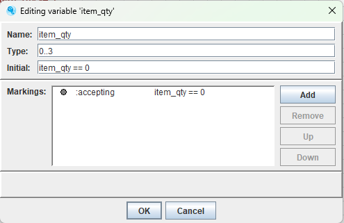
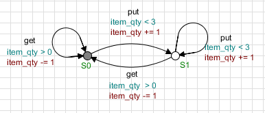
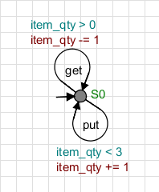

# Buffer

Nesse exemplo será apresentado o conceito de guardas e ações do supremica.

### Variável  
Temos a variável item_qty que possui um intervalo de 0 à 3, que determina os valores do estado. Ele representa a quantidade de itens que o buffer suporta. Esse intervalo é determinado na caixa de entrada  `Type` e seu valor inicial deve ser determinado em `Initial`.

  

### Buffer
Utiliza além do valor da variável, os estados para determinar se pode ou não colocar ou retirar itens.
Estados **ter item** e **não ter item**

  

### Buffer Minimizado
Utiliza apenas os valores das variáveis para saber se buffer possui item e apenas um estado para definir se tem ou não itens.

  

### Observação
Ambos os buffers possuem o mesmo comportamento, porém  se tratando do minimizado não se pode observar o seu comportamento pelo Supremica, pois o `Simulator` não permite visualizar autômatos com apenas um único estado, por isso a existência do buffer com mais estados e transições.