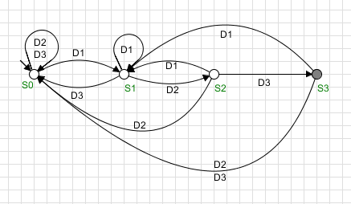

# Detector de Sequência de Digitos

Nesse exemplo encontra-se um modelo de uma máquina de estados finito que lê digitos num conjunto de eventos {1,2,3}. Se em uma string conter a substring 123 o autômato detecta e vai para o estado marcado.

Para a implementação, os eventos do conjunto foram nomeados como $E$ = \{D1,D2,D3} criando e seus estados {S0,S1,S2,S3}, sendo S3 o estado marcado de identificação da sequência.

