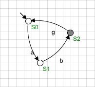

# Lidando com Deadlock e Livelock

Nesse exemplo encontramos no autômato com partes Acessíveis e Coacessíveis. Uma parte acessível são os estados que não possuem entradas, apenas saídas, esse tipo é importante quando se tem composição entre duas máquinas de estados. Já a parte coacessível são os estados que não possuem transições que levem até o estado marcado. Na imagem abaixo podemos ver tal autômato.

  

Com base nessas ideias temos o operador de Acessibilidade - $Ac(G)$ e o de Coacessibilidade - $CoAc(G)$, sendo $G$ um autômato. Veja que o dado o seu conceito a operação CoAc sobre um autômato, ele nunca afetará sua linguagem marcada de $G$, $L_m(G)$.

Quando um autômato é tanto Acessível quanto Coacessível, é dado o nome de Trim, e sua operação ocoore de tal forma: 

$$
Trim := CoAc[Ac(G)] = Ac[CoAc(G)]
$$

### Aplicando o Trim ao Modelo

Ao utilzarmos o supervisor do Supremica, clicando em `Analyzer` e posteriormente na sua planta, ao ir em `Analyze > Synthesize` podemos gerar um supervisor controlável e não bloqueante, para esse caso, tal processo irá retornar o Trim do autômato acima. Seu supervisor pode ser visto abaixo.

  

